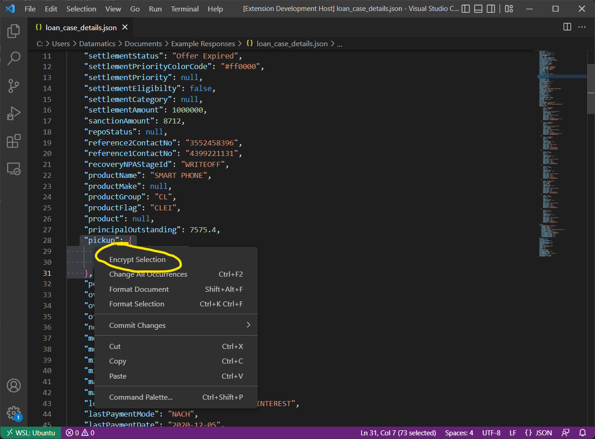
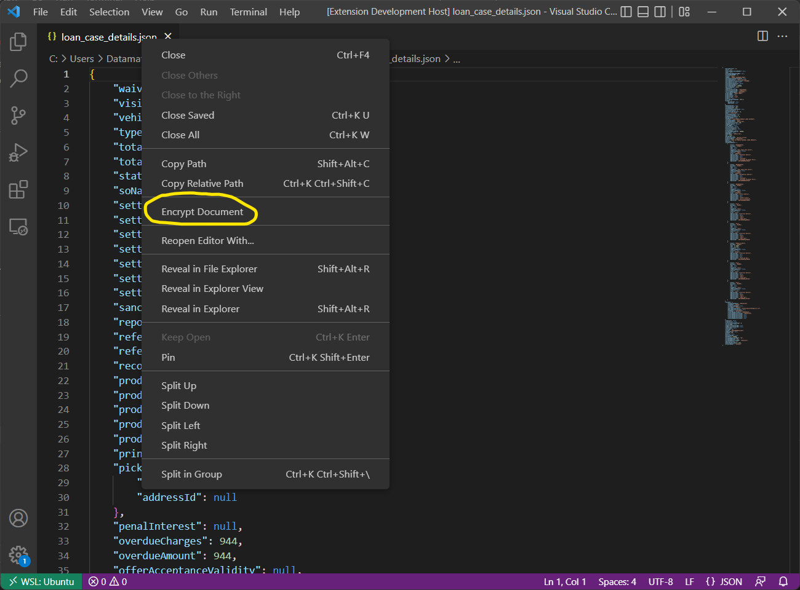
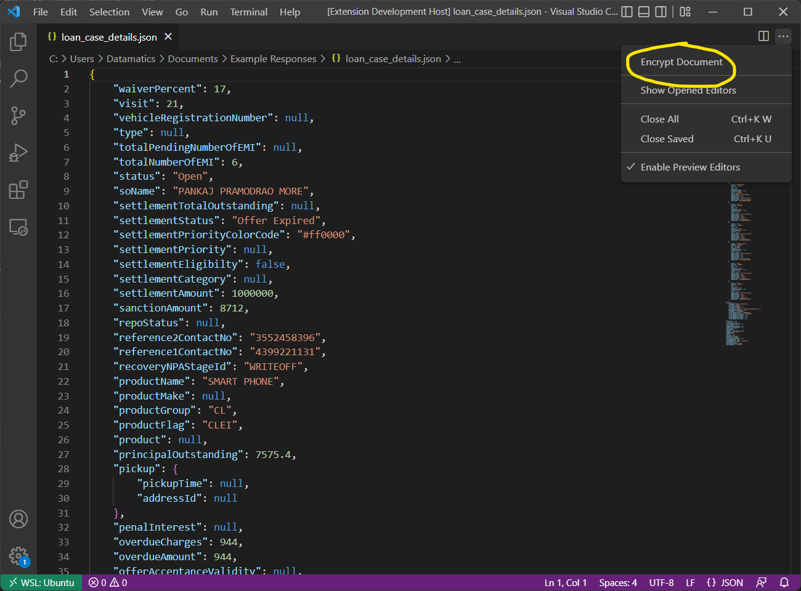

## 0.0.6 (2022.08.05)

- **Feature**: JSON Editors will now have a context menu.
- 
- 
- 

## 0.0.3 (2021.12.14)

- **Enhancement**: Alert will be shown on extension activation if algorithm values aren't set.

## 0.0.2 (2021.12.09)

- **Update**: Choice to open editor beside active editor or as a full column editor.
- **Update**: Improved stability.

## 0.0.1 (2021.11.29)

- **New**: Encrypt JSON and output to readonly plaintext editor.
- **New**: Decrypt ciphertext and output to readonly JSON editor.