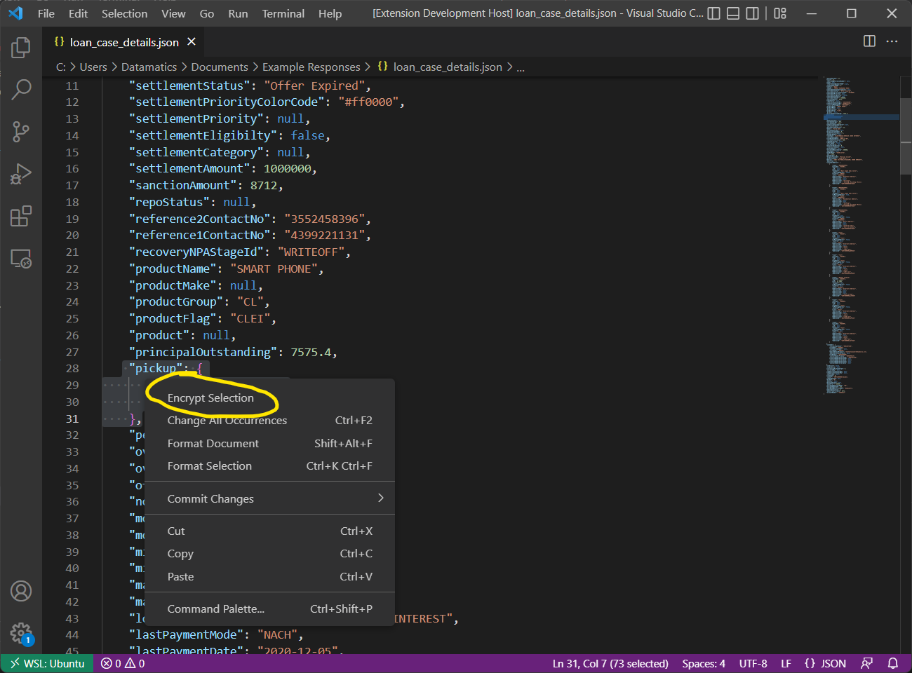
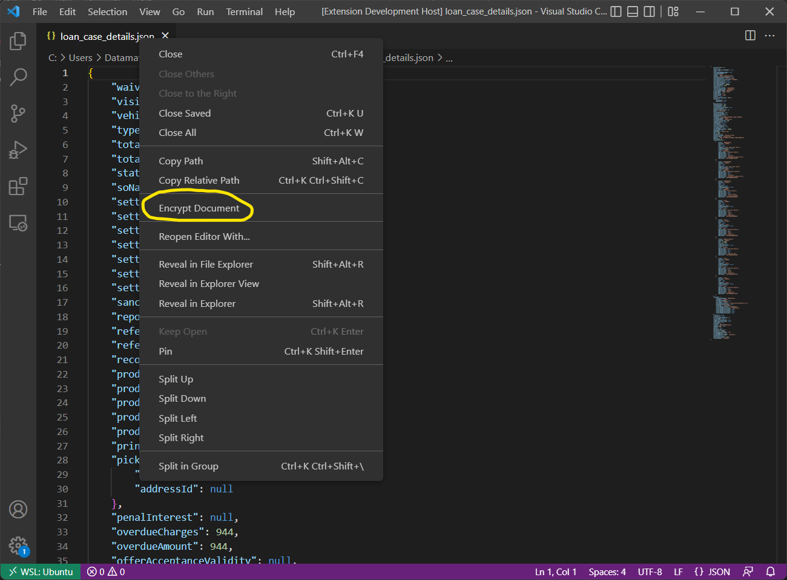

# Collection App Dev: Encryption Decryption Assistant

JSON objects encryption & decryption tool to the rescue of *Collections-App* developers toiling hard for days and nights.

## Features

### Read-only editor output

* Output for encryption & decryption are opened in a new readonly editor beside the active window.

## Usage

### Setup variables for the algorithm

1. Go to extension settings.
2. Set values for *Initialization Vector* and *Secret Key* before heading to other extension commands.

### Encrypting JSON

1. Open up the *Command Palette*.
2. Locate the command by searching for the extension name.
3. Put the input in the input box and hit *Enter*.
    
4. Or open any JSON document (saved or unsaved) and use the context menus as shown below.

### Decrypting Text

- Same steps as of *Encrypt JSON* command.

